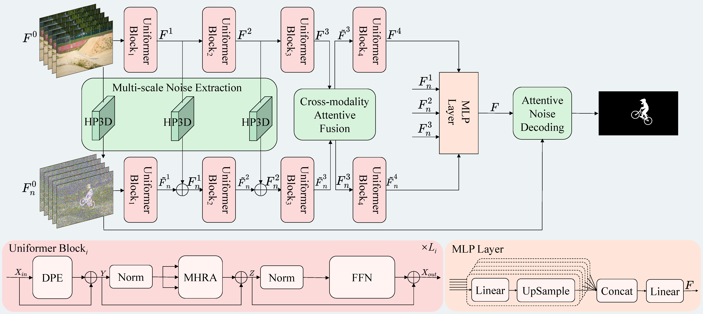

## Trusted Video Inpainting Localization via Deep Attentive Noise Learning
An official implementation code for paper "[Trusted Video Inpainting Localization via Deep Attentive Noise Learning](https://doi.org/10.1109/TDSC.2025.3595960)". This repo provides code and trained weights.

## Framework

<p align='center'>  
  
</p>

## Dependency
- torch 1.7.0
- python 3.7

## Datasets
1. [DAVIS2016](https://davischallenge.org/)
2. [DAVIS2017](https://davischallenge.org/)
3. [MOSE](https://github.com/henghuiding/MOSE-api)
4. [VOS2k5-800](https://www.123684.com/s/2pf9-9bWHv) (in this paper we use 800 videos from VOS2k5)

The `MOSE100` dataset in this paper can be found in [this](https://www.123684.com/s/2pf9-EbWHv)

## Video inpainting algorithms
1. [VI](https://github.com/mcahny/Deep-Video-Inpainting)
2. [OP](https://github.com/seoungwugoh/opn-demo)
3. [CP](https://github.com/shleecs/Copy-and-Paste-Networks-for-Deep-Video-Inpainting)
4. [E2FGVI](https://github.com/MCG-NKU/E2FGVI)
5. [FuseFormer](https://github.com/ruiliu-ai/FuseFormer)
6. [STTN](https://github.com/researchmm/STTN)
7. [FGT](https://github.com/hitachinsk/FGT)
8. [FGVC](https://github.com/vt-vl-lab/FGVC)
9. [ISVI](https://github.com/hitachinsk/ISVI)

## Usage

For example to train:
```bash
python train.py
```

For example to test:
download [TruVIL_train_VI_OP.pth](https://drive.google.com/file/d/1eIttOWmFopKKGFyEN5yaUJfdZeg2nfDu/view?usp=sharing) and place it in `checkpoints` directory.
```bash
python test.py
```

For example to inference:
download [TruVIL_train_VI_OP.pth](https://drive.google.com/file/d/1eIttOWmFopKKGFyEN5yaUJfdZeg2nfDu/view?usp=sharing) and place it in `checkpoints` directory.
```bash
python inference.py
```

## Citation
If you use this code for your research, please cite our paper
```
@article{lou2025trusted,
  title={Trusted Video Inpainting Localization via Deep Attentive Noise Learning},
  author={Lou, Zijie and Cao, Gang and Guo, Kun and Yu, Lifang and Weng, Shaowei},
  journal={IEEE Transactions on Dependable and Secure Computing},
  year={2025},
  publisher={IEEE}
}
```
## License
Licensed under a [Creative Commons Attribution-NonCommercial 4.0 International](https://creativecommons.org/licenses/by-nc/4.0/) for Non-commercial use only.
Any commercial use should get formal permission first.
